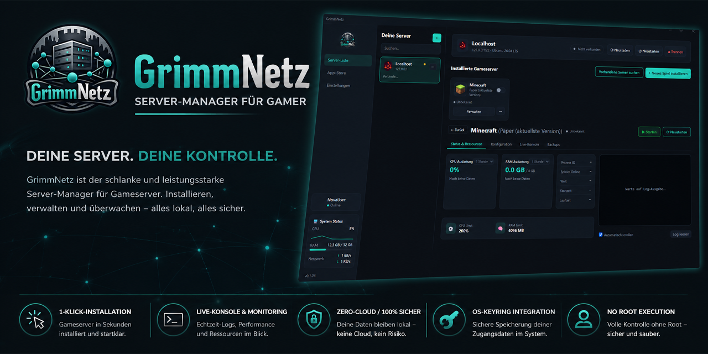

# GrimmNetz

Ressourcenschonende, plattformübergreifende Desktop-App (Tauri 2) zum Verwalten von dedizierten Gameservern auf Linux-VPS via SSH — ohne CLI-Kenntnisse.

Lizenziert unter [GPL-3.0](LICENSE) — bleibt Open Source, Forks müssen offen bleiben.

## Features

**Server-Verwaltung**
- Mehrere Root-/VPS-Server per SSH verbinden, live CPU/RAM/Disk-Auslastung im Blick
- Automatische Ersteinrichtung: legt einen isolierten `gameserver`-Systemnutzer an (Gameserver laufen nie als `root`), richtet passwortloses Sudo für die App ein
- Unterstützt Ubuntu/Debian und Fedora/RHEL/CentOS/Rocky/AlmaLinux — Paketmanager-Befehle werden automatisch passend zur erkannten Distro gewählt
- Legt automatisch eine Swap-Datei an, falls der Server keine hat (verhindert, dass der OOM-Killer den Gameserver bei RAM-Spitzen killt)
- Öffnet benötigte Firewall-Ports automatisch (ufw/firewalld), sobald ein Spiel installiert oder ein Port in der Konfiguration geändert wird

**Gameserver-Installation**
- App-Store-artige Installation per Klick, aktuell für 9 Spiele: Minecraft (Paper), Palworld, 7 Days to Die, DayZ, Factorio, Satisfactory, SCUM, Valheim, V Rising
- Läuft als `systemd`-Service (überlebt Reboots, startet bei Absturz automatisch neu)
- Minecraft zieht automatisch die neueste Paper-Version; zeigt installierte vs. verfügbare Version an und bietet einen Update-Button

**Betrieb & Kontrolle**
- Start/Stop/Neustart per Klick, Live-Status und Uptime
- Live-Konsole (Log-Streaming) pro Instanz
- Server-Einstellungen (Name, Slots, Passwort, Port, ...) direkt in der App bearbeiten — kein Ordnerwühlen nötig (aktuell für Minecraft & Factorio)
- Backup-Manager: Ein-Klick-Backup als `.tar.gz`, herunterladen oder auf dem Server löschen
- Einfache Verzeichnis-Ansicht fürs Hauptverzeichnis und den Backup-Ordner, ohne dass Nutzer sich durch die Linux-Shell wühlen müssen

**App selbst**
- Auto-Updater mit Patch-Notes-Dialog (öffnet sich automatisch nach einem Update, jederzeit über die Versionsnummer erreichbar)
- System-Status-Widget (CPU/RAM/Netzwerk des eigenen PCs) in der Sidebar

## Stack

- **Frontend**: React + TypeScript (Vite)
- **Backend**: Rust (Tauri 2, `tokio`, `russh`)
- **Datenbank**: SQLite, verschlüsselt via SQLCipher
- **Secrets**: OS-Keyring (Windows Credential Manager / Gnome Keyring / KWallet) — niemals im Klartext

## Sicherheitsprinzipien

1. Zero-Cloud-Storage — alle Server-Logins bleiben lokal
2. Passwörter/Passphrasen ausschließlich im OS-Keyring
3. Gameserver laufen nie als `root`, sondern unter einem isolierten `gameserver`-User

## Entwicklung

Voraussetzung unter Windows: [OpenSSL (Dev, inkl. Header/Libs)](https://slproweb.com/products/Win32OpenSSL.html) installiert, wird für das Linken von SQLCipher benötigt. Der Installer legt die `.lib`-Dateien in einem `VC`-Unterordner ab, nicht direkt unter `lib/` — `OPENSSL_DIR` allein reicht dem Linker deshalb nicht, `OPENSSL_LIB_DIR` muss explizit auf den passenden Unterordner zeigen:

```bash
export OPENSSL_DIR="C:/Program Files/OpenSSL-Win64"
export OPENSSL_LIB_DIR="C:/Program Files/OpenSSL-Win64/lib/VC/x64/MD"
export OPENSSL_INCLUDE_DIR="C:/Program Files/OpenSSL-Win64/include"

npm install
npm run tauri dev
```

`npm run tauri build` baut lokal exakt den Installer, den auch die Release-Pipeline erzeugt — gut zum Testen vor einem echten Release.

## Releases & Auto-Update

Releases werden ausschließlich über GitHub Actions gebaut (`.github/workflows/release.yml`), niemals lokal veröffentlicht. Ein neues Release auslösen:

```bash
git tag v0.1.1
git push origin v0.1.1
```

Die Pipeline baut den signierten Windows-Installer (NSIS/MSI) und veröffentlicht ihn als GitHub Release inkl. `latest.json`. Die App prüft beim Start automatisch auf neue Versionen und zeigt "Update verfügbar, jetzt installieren".

Siehe [`src-tauri/resources/games.json`](src-tauri/resources/games.json) für die Spiele-Template-Datenbank und [`src/patchNotes.ts`](src/patchNotes.ts) für die Release-Notes, die in der App angezeigt werden.
